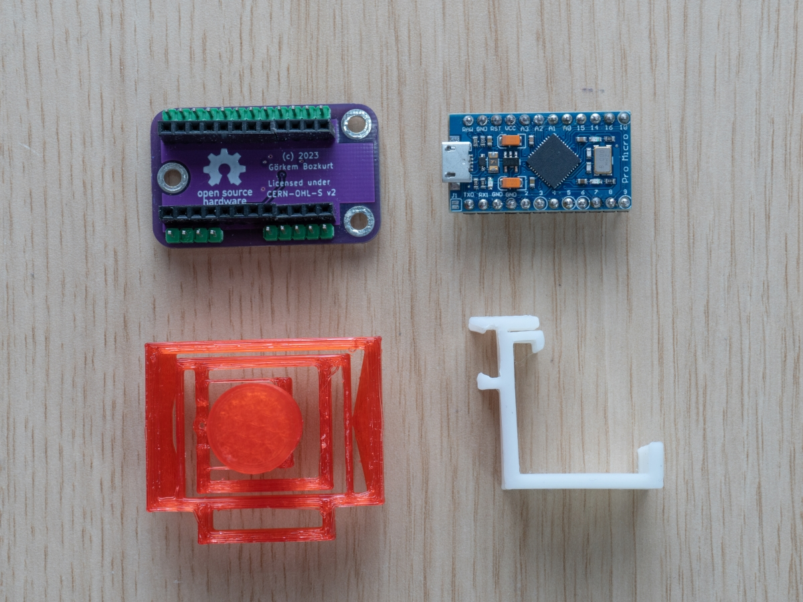
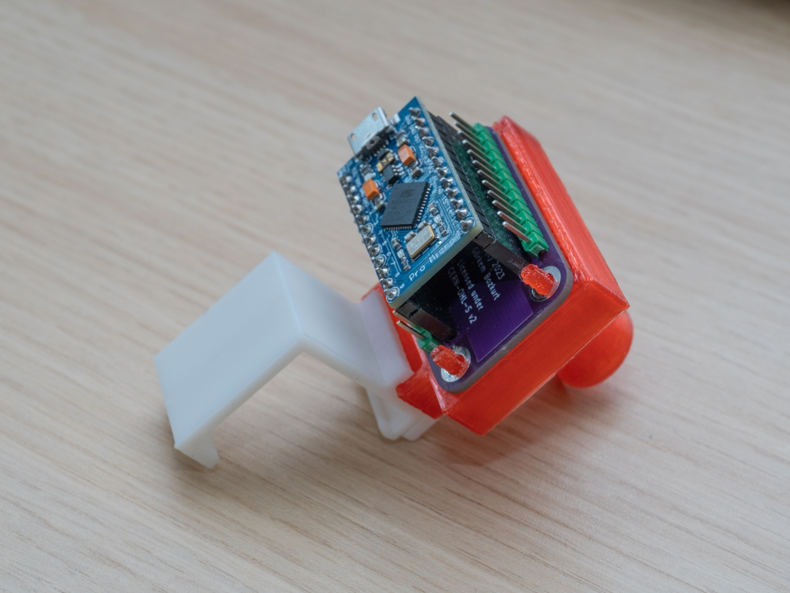

# Trinteract

This repository contains all the files and documentation for Trinteract, An open-source Arduino-compatible 3DOF Human Interface Device (HID). In other words a joystick that's capable of moving in all 3 Dimensions. Trinteract uses a 3D magnetometer and a Neodymium magnet to detect motion in 3D space.  [Visit the DIY guide](https://www.instructables.com/Trinteract-an-Open-source-3D-Input-Device/)

[Watch the Demo here](https://youtu.be/YoGgdORVARs)

File structure:
+  `Software` contains the arduino code and necessary drivers 
+  `PCB` contains the KiCAD PCB files and gerber files for manufacturing
+  `docs` contains the source code for the documentation website build with [Sphinx](https://www.sphinx-doc.org/en/master/index.html)
+  `CAD` contains all fusion360 CAD files and print ready .stl files  

Before Assembly            |  Assembled
:-------------------------:|:-------------------------:
  |  

    

<a href="https://certification.oshwa.org/ee000001.html">[OSHW] EE00001 | Certified open source hardware</a>

