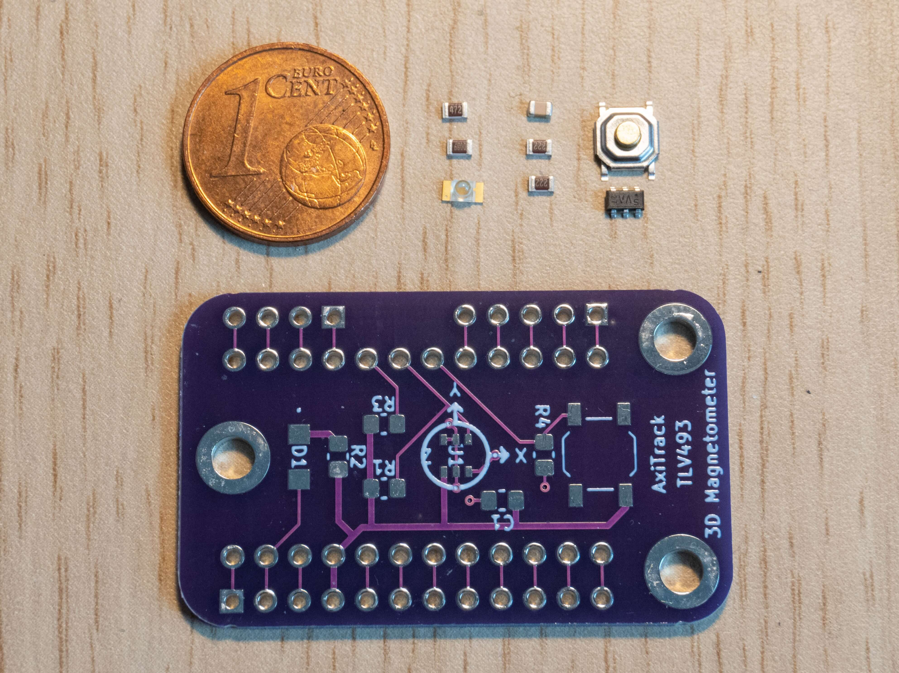
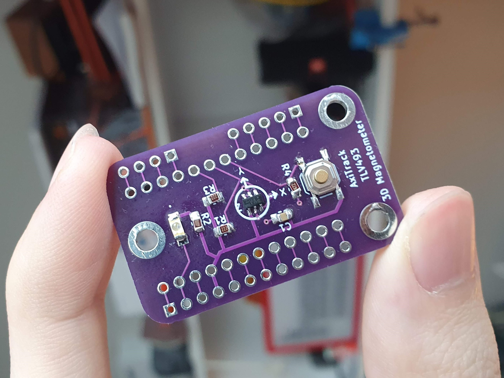
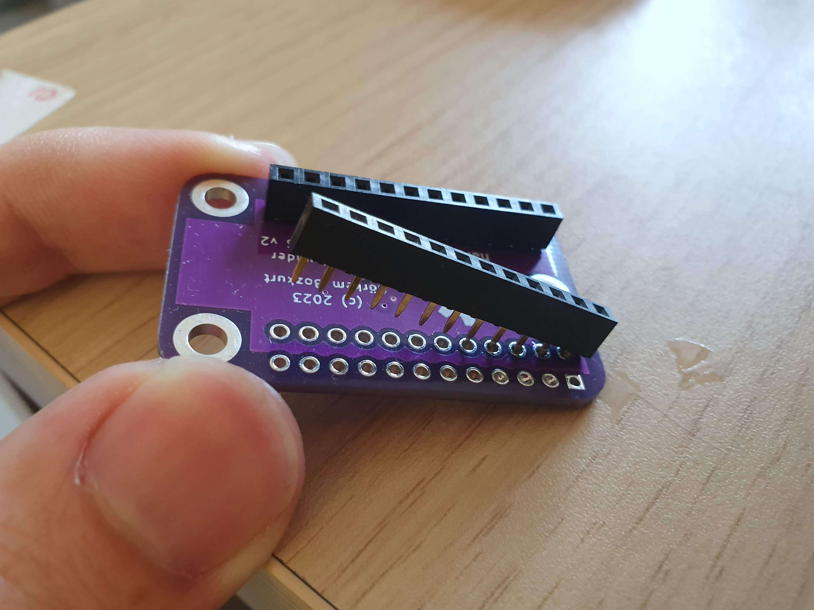

Soldering
=========

SMD Components
--------------

.. note::
   The PCB in these pictures are from the previous version, I'll update them once I receive the new batch. The only difference in the new version is the button placement. The newer version has the button on the back.

The components can be soldered on to the PCB by hand, but you could also use solder paste and a reflow oven to make the process easier. I followed this tutorial 
for the hand soldering:

.. raw:: html
    
    <iframe width="560" height="315" src="https://www.youtube.com/embed/4zXP0TtORWo" title="YouTube video player" frameborder="0" allow="accelerometer; autoplay; clipboard-write; encrypted-media; gyroscope; picture-in-picture; web-share" allowfullscreen></iframe>

Through-Hole Components
-----------------------

The only Through-Hole components in this build are te header pins. You can also solder additional expansion pins if you plan to prototype with the board.

