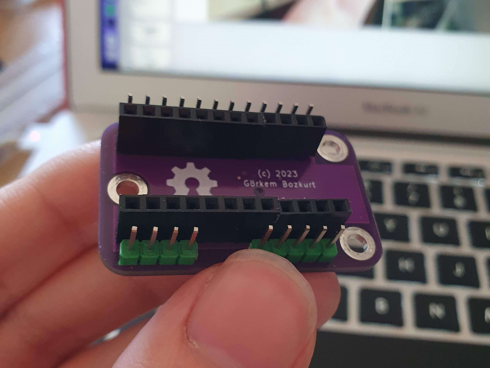
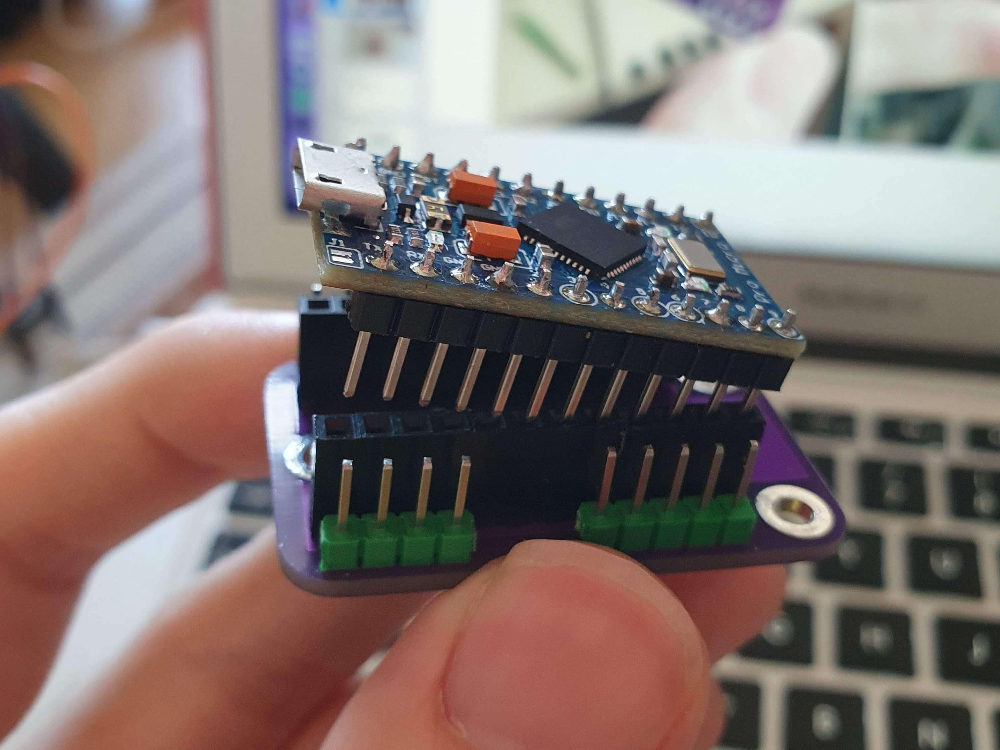
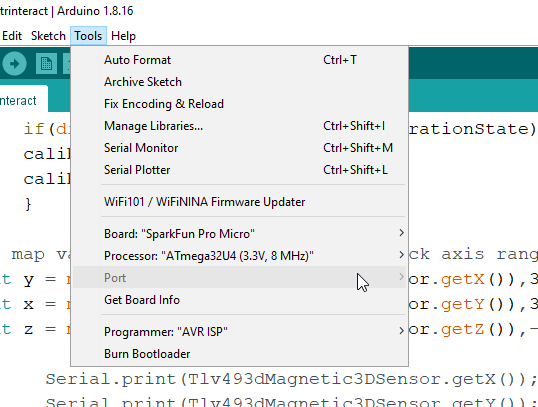

Assembly and Testing
====================

Connecting to Arduino
---------------------

After you conect the board to arduino as shown in the picture, download the arduino code from  `the repository <https://github.com/gocivici/trinteract>`_ and upload the code to the
arduino with the following settings:

