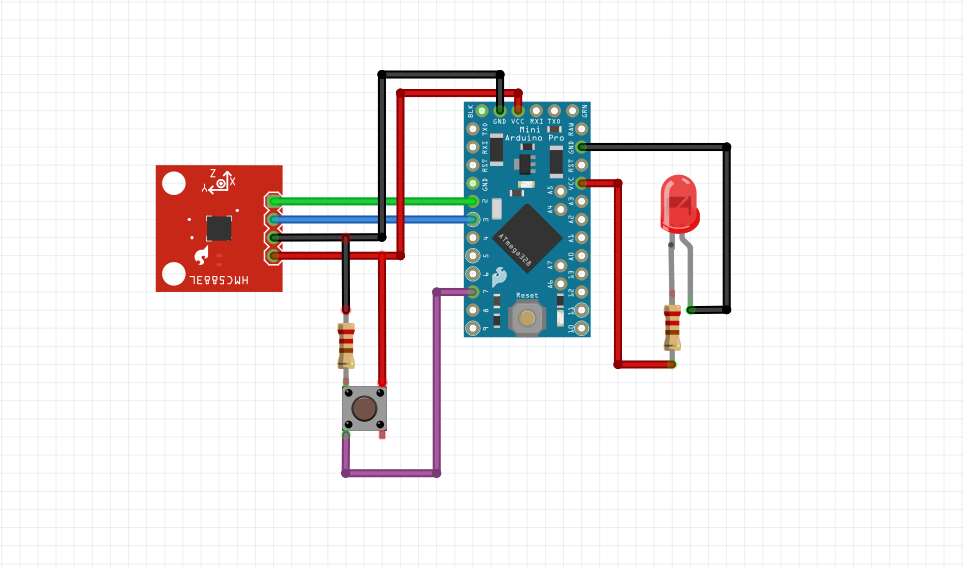

Overview
========

Trinteract is basically a compact breakout board for the TLV493 Magnetometer. You can use off-the-shelf components to prototype it first before you 
order a PCB. Here's a wiring guide for a simple prototype that features the magnetic sensor, an Arduino pro micro, a LED and a tactile button: 

If you decide to manufacture the PCB you can follow `this interactive BOM guide <../ibom.html>`_ to keep track of the parts: 

Parts for PCB
-------------

* :doc:`Trinteract pcb </build_your_own/Fabrication>` 
* `Infenion TLV493DA Low Power 3D Magnetic Sensor <https://eu.mouser.com/ProductDetail/Infineon-Technologies/TLV493DA1B6HTSA2?qs=0DP5yvOrqYnbdRXsuslLCg%3D%3D&countryCode=DE&currencyCode=EUR>`_
* '2 x 2.2k Ω SMD Resistor 0805 - R1 & R3
* '680 Ω SMD Resistor 0805 - R2
* '4.7k Ω SMD Resistor 0805 - R4
* '100n SMD Capacitor 0805 - C1
* 'Tactile Switch 5 X 5mm,  2 mm Actuator Height
* 4x4mm neodymium cube magnet

': *These parts can be bought from any major electronics supplier, like Digikey or Mouser*

